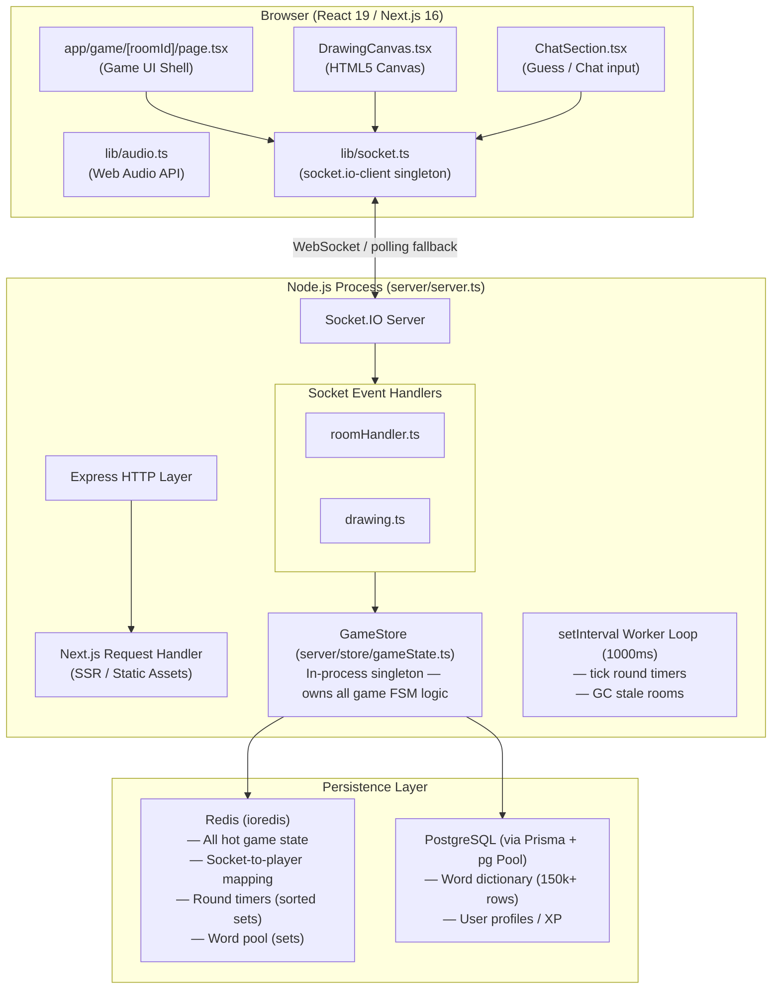

# ARCHITECTURE.md — Scribble System Architecture

## Overview

Scribble is a real-time multiplayer drawing-and-guessing game (in the style of skribbl.io) built on a **unified Next.js + Express + Socket.IO** server process. All game logic, WebSocket communication, and HTTP serving happen inside a single Node.js process served by a custom `server.ts` entry point, rather than using Next.js's built-in server. This is a deliberate architectural choice explained in detail below.

---

## High-Level Component Map

---

## Component Breakdown

### 1. `server/server.ts` — The Bootstrap

This is the application's single entry point. It:

1. Calls `app.prepare()` to initialise the Next.js compiler/router.
2. Creates an **Express** app, wraps it in a raw `http.Server`.
3. Attaches a **Socket.IO** server to the same `http.Server` so both HTTP and WS traffic share port `3000`.
4. Falls through all non-Socket.IO HTTP requests to Next.js's `handle()` function — making Next.js a middleware.

**Why not use Next.js's `pages/api` route for WebSockets?**  
Next.js API routes (including App Router route handlers) are serverless-style: each invocation is stateless and scoped to a single HTTP request. Long-lived, stateful WebSocket connections cannot be reliably held open in that model, especially under Vercel's edge/serverless runtime. Using a custom Express server with `socket.io` gives us full control over the TCP connection lifecycle.

**Why Express instead of raw `http`?**  
Express is used as a thin middleware wrapper for the health-check endpoint (`GET /api/custom-health-check`) and future REST routes. It adds negligible overhead (<0.1ms per request) vs raw `http`, and its middleware API is far more ergonomic for scaling out REST concerns.

---

### 2. Socket.IO Handlers

Two handler files register listeners on each socket connection:

| File | Responsibility |
|---|---|
| `roomHandler.ts` | `join_room`, `chat_message`, `start_game`, `sync_canvas`, `disconnect` |
| `drawing.ts` | `draw_batch` |

Each handler is a **pure function** that receives `(io, socket)` and registers event listeners — no state is stored inside handlers themselves. All mutable game state lives exclusively in `GameStore` backed by Redis.

---

### 3. `GameStore` — The Brain

`GameStore` is an in-process singleton (one per Node.js process). It:

- Exposes purely async methods that read/write Redis.
- Owns a **server-side 1-second `setInterval` worker loop** that scans two Redis sorted sets (`active_rounds`, `transition_rounds`) for expired rounds and advances the game FSM.
- Is **stateless with respect to Node.js memory** — every piece of game state lives in Redis. This is critical: if the Node.js process restarts (crash, deploy), no game state is lost.

This design is a hybrid: the worker runs **in-process** (not a separate microservice), but all its reads/writes are **out-of-process** to Redis. The benefit is simplicity; the trade-off is that with multiple instances you'd need only one worker firing per room per tick (currently unguarded — a known limitation).

---

### 4. Redis — Primary Data Store

Redis serves as the **source of truth** for all real-time game state:

- Room metadata (`HASH`)
- Player data (`HASH` per player)
- Player ordering (`LIST`)
- Player membership set (`SET`)
- Round timer tracking (`ZSET`)
- Leaderboard (`ZSET`)
- Word pool per room (`SET`)
- Socket ↔ Player ID mappings (`STRING`)

Redis is chosen over PostgreSQL for hot state because:
- Sub-millisecond reads vs ~5ms+ for a Postgres round-trip.
- Native data structures (sorted sets for timer queues, sets for random pop) match game logic perfectly with zero serialization overhead.
- Atomic operations (`MULTI`/`EXEC` pipelines) prevent race conditions without application-level locking.

---

### 5. PostgreSQL + Prisma — Cold Storage

PostgreSQL via the `pg` Pool and `@prisma/adapter-pg` stores:
- The `Word` dictionary (fetched in bulk of 150 at a time, cached in Redis `SET` per room).
- The `User` model (XP tracking — currently scaffolded, not fully integrated into game loop).

Read from PostgreSQL **only when** the per-room word cache in Redis is exhausted. This means the typical game generates **0 PostgreSQL queries per round** after the first one.

---

## Design Decisions — WHY This Architecture

| Decision | Alternatives Considered | Reason Chosen |
|---|---|---|
| Unified server (Next.js + Express + Socket.IO on one port) | Separate WebSocket server on different port | Avoids cross-origin socket URLs, simplifies Docker/proxy config, reduces DevOps surface |
| Redis as primary game state store | In-memory JS Map/Object | Survives restarts, supports future multi-instance horizontal scaling |
| Server-side `setInterval` round timer | Client-side timers, DB cron | Prevents cheating (client can't manipulate timer), single authoritative tick |
| Sorted sets for round timers | DB row with `expiry_time` field | O(log N) range queries, native TTL-like semantics without polling DB |
| Batch draw events (50ms or 20-point threshold) | Emit every `mousemove` | Dramatically reduces message frequency (~20x); avoids saturating WebSocket backpressure |
| Normalised coordinates for draw points | Raw pixel coordinates | Canvas is responsive; normalised values make drawings device-resolution-agnostic |
