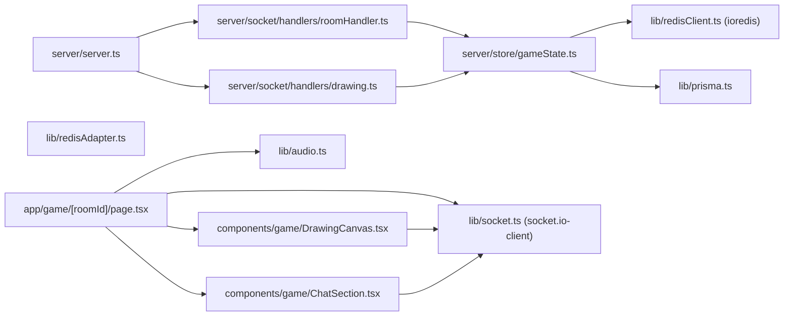

# MODULES.md — Core Module Deep Dives

## Module Dependency Graph



---

## `server/store/gameState.ts` — GameStore

The most complex module in the codebase. It is a class (`GameStore`) exported as a singleton (`gameStore`), containing all game FSM logic. Every method is `async` and interacts with Redis.

### `setIo(io)` + Worker Loop

```typescript
setIo(io: any) {
    this.io = io;
    if (!this.workerStarted) {
        this.workerStarted = true;
        setInterval(() => this.workerLoop(), 1000);
    }
}
```

`setIo` is called on every new socket connection (`roomHandler` calls it first). The `workerStarted` guard ensures the `setInterval` fires only once regardless of how many sockets connect. The `io` reference is stored in the instance — this is the mechanism by which server-side timer expiry can push events to clients without a triggering socket event.

**Why not pass `io` to each method signature?**  
Methods like `endRound` and `processNextRound` are called from the worker loop (no active socket context). They need `io` to emit to rooms. Storing `io` on the instance avoids threading `io` through every call chain.

---

### `workerLoop()` — The Heartbeat

```typescript
async workerLoop() {
    const now = Date.now();
    
    // 1. End expired rounds
    const expiredRounds = await redis.zrangebyscore("active_rounds", "-inf", now);
    for (const roomId of expiredRounds) {
        await redis.zrem("active_rounds", roomId);
        await this.endRound(roomId, this.io);
    }
    
    // 2. Process next round after transition
    const expiredTransitions = await redis.zrangebyscore("transition_rounds", "-inf", now);
    for (const roomId of expiredTransitions) {
        await redis.zrem("transition_rounds", roomId);
        await this.processNextRound(roomId, this.io);
    }
    
    // 3. GC stale rooms (>30 min inactivity)
    const thirtyMinsAgo = now - 1800000;
    const staleRooms = await redis.zrangebyscore("room_activity", "-inf", thirtyMinsAgo);
    for (const roomId of staleRooms) {
        await this.forceDeleteRoom(roomId);
    }
}
```

**Three responsibilities in one loop:**
1. **Round timer**: Advance `PLAYING → ROUND_END` when time expires.
2. **Transition timer**: Advance `ROUND_END → PLAYING` (or `GAME_OVER`) after 3s display delay.
3. **Room GC**: Delete rooms abandoned for 30+ minutes.

**Why loop-in-one?** Simplicity. Three separate intervals would complicate shutdown logic and increase Redis I/O (each separate interval runs separate ZRANGEBYSCORE queries). Combining them in one loop costs one extra tick per operation type but simplifies the codebase significantly.

**Serial processing of expiredRounds**: Rooms are processed one-at-a-time with `for...of` + `await`. A `Promise.all` would be faster but risks overwhelming Redis with concurrent writes during a "thundering herd" (e.g., 100 rooms all starting at the same second). Serial processing adds at most 1–2ms per extra room, well within the 1,000ms loop budget.

---

### `checkGuess()` — The Core Game Logic

This is the most performance-critical method per user interaction. Full annotated flow:

```typescript
async checkGuess(roomId, playerId, guess, io) {
    // Step 1: Fetch 4 fields from room hash in ONE Redis call (HMGET)
    const [status, word, drawerId, roundEndTimeStr] = 
        await redis.hmget(`room:${roomId}`, "status", "currentWord", "drawerId", "roundEndTime");
    
    await this.updateActivity(roomId);  // ZADD room_activity (prevents GC)

    // Step 2: Guard clauses — return early without scoring
    if (!status || status !== "PLAYING" || !word) return false;
    
    const player = await redis.hgetall(`player:${playerId}`);
    if (!player || Object.keys(player).length === 0) return false;
    if (player.hasGuessed === "true" || drawerId === playerId) return false;
    
    // Step 3: Case-insensitive comparison
    if (guess.toLowerCase() !== word.toLowerCase()) return false;

    // Step 4: Time-based scoring
    // Points: 100 * (timeLeft / 60s), minimum 10 points
    // First guesser in a 60s round gets ~100pts; last guesser gets ~10pts
    const timeRatio = Math.max(0, roundEndTime - Date.now()) / 60000;
    const points = Math.max(10, Math.floor(100 * timeRatio));

    // Step 5: Atomic multi-update pipeline
    const tx = redis.multi();
    tx.hset(`player:${playerId}`, "hasGuessed", "true");
    tx.hincrby(`player:${playerId}`, "score", points);
    tx.zincrby(`room:${roomId}:leaderboard`, points, playerId);
    // Drawer also earns half the guesser's points
    tx.hincrby(`player:${drawerId}`, "score", drawerPoints);
    tx.zincrby(`room:${roomId}:leaderboard`, drawerPoints, drawerId);
    await tx.exec();

    // Step 6: Check if ALL non-drawer players have guessed
    // Uses pipeline for N players — single RTT
    const pipeline = redis.multi();
    playerIds.forEach(id => pipeline.hget(`player:${id}`, "hasGuessed"));
    const results = await pipeline.exec();
    
    const allGuessed = playerIds.every((id, index) => {
        if (id === drawerId) return true;  // drawer always "done"
        return results[index][1] === "true";
    });

    if (allGuessed) {
        await redis.zrem("active_rounds", roomId);
        this.endRound(roomId, io);  // Note: NOT awaited — fire and forget
    }

    return true;
}
```

**Scoring formula**: `points = max(10, floor(100 * (timeLeft / 60000)))`. With 60 seconds per round, the first correct guesser gets close to 100 points. The 10-point floor ensures even a last-second guess is rewarded. The drawer earns 50% of each guesser's points — incentivizing clear drawing.

**Note: `this.endRound` is not awaited** in the `allGuessed` path. This means `checkGuess` returns `true` immediately, allowing the socket handler to emit the correct-guess events before the round-end events. If `endRound` were awaited here, the response to the guesser would be delayed by the round-end processing time.

---

### `getNextDrawer()` — Turn Rotation Logic

```typescript
async getNextDrawer(roomId, currentDrawerId) {
    const players = await redis.lrange(`room:${roomId}:players`, 0, -1);
    
    // Find index of current drawer, rotate +1 (with wraparound)
    const idx = players.indexOf(currentDrawerId);
    const startIndex = idx === -1 ? 0 : (idx + 1) % players.length;
    
    // Check which players are online (have active socket mapping)
    const pipeline = redis.multi();
    players.forEach(id => pipeline.get(`player:${id}:socket`));
    const results = await pipeline.exec();
    const socketIds = results.map(([_, res]) => res);
    
    // Return the FIRST online player starting from startIndex (circular scan)
    for (let i = 0; i < players.length; i++) {
        const index = (startIndex + i) % players.length;
        if (socketIds[index]) return players[index];
    }
    return null;  // No one online
}
```

This is a **circular rotation** through the LIST-ordered player sequence. The LIST preserves join order, so players take turns in join order. If a player disconnects, they're skipped (their socket mapping is null) — the next online player in sequence draws.

**Round increment logic** (in `processNextRound`): A new round is counted only when the drawer rotation **wraps back to the first player** (i.e., all players have drawn once). This is detected by checking `nextDrawerId === players[0].id`.

---

## `components/game/DrawingCanvas.tsx` — The Rendering Engine

### Coordinate System Design

The canvas element has a CSS size (`width: 100%; height: 100%`) and an internal pixel buffer size (`canvas.width = parent.clientWidth`). These are set once on mount:

```typescript
useEffect(() => {
    const parent = canvas.parentElement;
    canvas.width = parent.clientWidth;   // actual pixel buffer
    canvas.height = parent.clientHeight;
}, []);
```

The canvas CSS size is responsive; the pixel buffer is fixed to the container size at mount time. This means the canvas does NOT dynamically resize — a window resize during a game session would cause the drawn content to stretch. This is a known limitation.

### Why Refs Instead of State for Drawing Points?

```typescript
const drawBatchRef = useRef<any[]>([]);
const lastEmitTime = useRef<number>(0);
const lastLocalPoint = useRef<{x,y} | null>(null);
```

All mutable drawing state uses `useRef`, not `useState`. React state updates are asynchronous and trigger re-renders — the last thing you want when rendering is already happening 60 times per second via mouse events. `useRef` mutates synchronously without scheduling any React work.

### Canvas Rendering vs React DOM

```typescript
const drawLine = useCallback((x0, y0, x1, y1, c, s) => {
    const ctx = ctxRef.current;
    ctx.beginPath();
    ctx.strokeStyle = c;
    ctx.lineWidth = s;
    ctx.lineCap = "round";
    ctx.lineJoin = "round";
    ctx.moveTo(x0, y0);
    ctx.lineTo(x1, y1);
    ctx.stroke();
    ctx.closePath();
}, []);
```

All drawing bypasses React entirely. `ctx` is a direct reference to the native `CanvasRenderingContext2D`. The function is `useCallback`-stabilized so it can be safely referenced inside the `useEffect` without re-registering socket listeners on every render.

`lineCap = "round"` + `lineJoin = "round"` are critical for smooth stroke appearance at stroke endpoint junctions.

---

## `lib/redisClient.ts` — ioredis Singleton

```typescript
export const redis = new Redis(process.env.REDIS_URL || "redis://localhost:6379");
```

`ioredis` is preferred over the official `redis` npm package because:
- Native TypeScript types.
- Built-in command pipelining with `.multi()`.
- Auto-reconnect with exponential backoff.
- Cluster support (for future scaling).
- `SPOP` with count argument support.

The singleton is exported as a module-level constant — Node.js module caching ensures only one Redis connection is created per process.

---

## `lib/redisAdapter.ts` — Socket.IO Redis Pub/Sub

```typescript
const pubClient = createClient({ url });
const subClient = pubClient.duplicate();
io.adapter(createAdapter(pubClient, subClient));
```

Note: This uses the `redis` package (node-redis v4), NOT `ioredis`. The `@socket.io/redis-adapter` was designed against `node-redis`. ioredis can be used with `@socket.io/redis-adapter` via a compatibility wrapper, but the current setup uses the official `node-redis` client.

**Why two clients (pub + sub)?**  
Redis pub/sub semantics: a client in SUBSCRIBE mode can only receive messages, not send commands. The adapter needs to both publish events (when `io.to(room).emit()` is called) and subscribe to events from other instances. Two separate connections are required.

The `setupRedisAdapter` function is **not currently called** in `server.ts` — it's prepared but dormant, awaiting multi-instance deployment.
