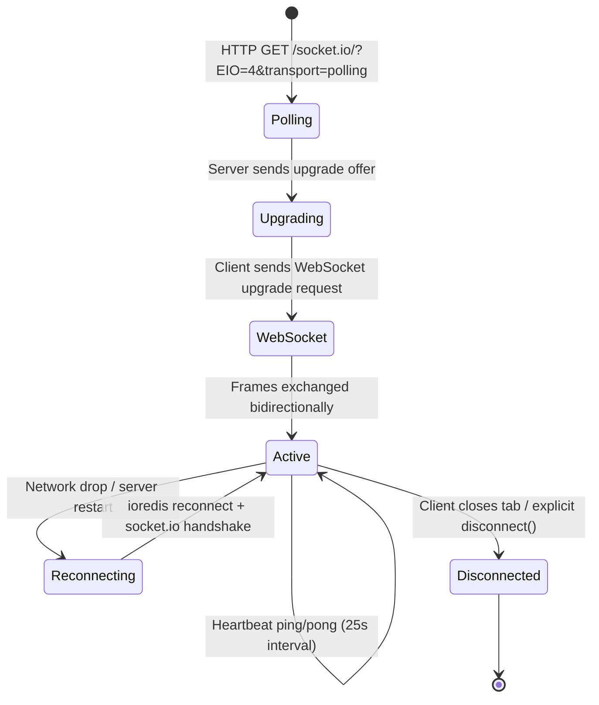
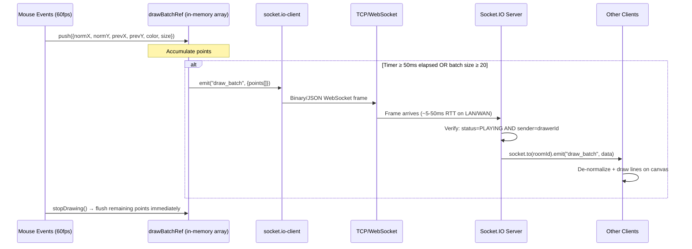

# REALTIME_COMMUNICATION.md — WebSocket Architecture & Low-Latency Design

## Technology: Socket.IO v4 over WebSocket

Scribble uses **Socket.IO 4.8** which negotiates the transport layer automatically:
1. First handshake via HTTP long-polling (to pierce firewalls/proxies).
2. Upgrades to a native WebSocket if the environment supports it, typically completing within one round trip (~50–100ms on a local network).

Once the WebSocket upgrade completes, all game events (drawing, chat, room state) travel over the persistent TCP connection, eliminating the HTTP overhead of headers (~300–800 bytes) on every message.

---

## Connection Lifecycle



### Handshake Detail

```
Client → Server: GET /socket.io/?EIO=4&transport=polling&t=<timestamp>
Server → Client: 0{"sid":"<id>","upgrades":["websocket"],"pingInterval":25000,"pingTimeout":20000}
Client → Server: 40  (connect packet)
Server → Client: 40  (connect ack with socket.id)

Client → Server: Upgrade: websocket (HTTP 101)
Server → Client: 101 Switching Protocols

[WebSocket frames begin]
Client → Server: 42["join_room",{...}]   (Socket.IO event frame)
Server → Client: 42["room_updated",{...}]
```

The `42` prefix is Socket.IO's encoding: `4` = message packet type, `2` = EVENT type.

---

## Message Flow: Drawing

Drawing is the most latency-sensitive event stream. Here's how it flows in detail:



### Why 50ms / 20-point Thresholds?

**50ms threshold (≈20 frames/sec):**  
Human visual perception of smooth motion requires ~24fps. At 50ms intervals we deliver ~20 updates/sec — imperceptible lag for drawing, but we halve the socket message rate compared to 25ms.

**20-point threshold:**  
Prevents a fast mouse stroke from accumulating a megabyte-sized batch if the 50ms timer hasn't fired. Each point is ~80 bytes JSON (`{x, y, prevX, prevY, color, size}`); 20 points ≈ 1.6KB — well within a single WebSocket frame.

**Server-side guard — `points.length > 200`:**  
Any payload exceeding 200 points is rejected. This prevents a malicious client from sending a 100KB JSON blob that could spike server CPU during JSON parsing.

### Coordinate Normalisation

```
Sender side:
  normX = rawPixelX / canvas.width       // range [0, 1]
  normSize = brushSize / canvas.width

Receiver side:
  pixelX = normX * receiverCanvas.width
  pixelSize = normSize * receiverCanvas.width
```

This is critical because different players may have different viewport sizes. Sending raw pixel coordinates would produce offset drawings on different screen sizes. Normalised [0,1] coordinates guarantee rendering fidelity regardless of resolution.

---

## Low-Latency Optimisations

| Technique | Effect |
|---|---|
| Persistent WebSocket (no HTTP per event) | Eliminates ~0.5ms–5ms TCP handshake per message |
| Draw batching (50ms / 20-point threshold) | Reduces message count ~20x vs per-mousemove emit |
| `socket.to(roomId).emit()` (server fan-out) | Single server-side call fans out to N clients; no N client→server→client round trips |
| In-memory `drawBatchRef` (useRef, not useState) | Never triggers React re-render on each point; pure mutable ref |
| `ctx.lineCap = "round"`, direct `Canvas2D API` | Bypasses React DOM reconciliation entirely for drawing — zero React overhead per stroke |
| Canvas sync via `toDataURL` on `player_joined` | New joiners get instant state without server storing/replaying draw history |

---

## Message Types Reference

| Event | Direction | Payload | Purpose |
|---|---|---|---|
| `join_room` | C→S | `{roomId, name, playerId}` | Player joins/rejoins |
| `room_updated` | S→C | `RoomState` | Authoritative state push |
| `room_state_updated` | S→C | `RoomState` | Alias; emitted on correct guess |
| `player_joined` | S→C | `{newPlayerSocketId}` | Triggers canvas sync from drawer |
| `draw_batch` | C→S | `{roomId, points[]}` | Batched draw strokes |
| `draw_batch` | S→C | same | Server relay to all other room members |
| `chat_message` | C→S | `{roomId, message}` | Chat / guess |
| `receive_message` | S→C | `{userId, userName, message}` | Incorrect-guess broadcast |
| `system_message` | S→C | `{type, ...}` | CORRECT_GUESS / ROUND_END notifications |
| `start_game` | C→S | `roomId` | Host starts the game |
| `sync_canvas` | C→S | `{targetSocketId, canvasData}` | Drawer sends snapshot to new player |
| `receive_canvas_sync` | S→C | `canvasData (base64 PNG)` | New player receives canvas snapshot |

---

## Scaling Strategy

### Current: Single Node.js Process

All Socket.IO rooms are in-memory inside one process. This handles hundreds of concurrent connections comfortably (Socket.IO benchmarks at ~10k concurrent connections per process at low message rates).

### Horizontal Scaling: Redis Adapter (Implemented, Switchable)

`lib/redisAdapter.ts` is already written:

```typescript
const pubClient = createClient({ url });
const subClient = pubClient.duplicate();
io.adapter(createAdapter(pubClient, subClient));
```

When enabled, Socket.IO uses Redis pub/sub to route events between instances:
- Instance A has a socket in room "abc123"
- Instance B receives `io.to("abc123").emit(...)` — the Redis adapter publishes to a Redis channel
- Instance A's adapter subscribes to that channel and fans out to the local socket

### Sticky Sessions Requirement

When using multiple instances behind a load balancer, HTTP long-polling requests must route to the same backend instance that owns the socket. Without sticky sessions, the polling upgrade handshake will fail because a different instance won't recognise the `sid`.

**Implementation:** Configure the load balancer (NGINX `ip_hash`, AWS ALB `AWSALB` cookie, or HAProxy `source` balance) to route all requests from a given client IP to the same backend.

**WebSocket note:** Once upgraded to a true WebSocket, sticky sessions are moot — the TCP connection persists and always hits the same instance.

### Pub/Sub Trade-offs vs HTTP Polling

| Dimension | WebSocket + Socket.IO | HTTP Long-Polling |
|---|---|---|
| Latency | 1–15ms (LAN/WAN) | 100ms–1s (polling interval) |
| Server connections | Persistent (CLOSE_WAIT risk) | Stateless |
| Fire-and-forget fan-out | Native (socket rooms) | Requires holding response queue |
| Load balancer compatibility | Requires upgrade support | Works anywhere |
| Message ordering | Guaranteed per TCP stream | Not guaranteed across polls |
| Overhead per message | ~10–50 bytes (WS frame) | ~300–800 bytes (HTTP headers) |
