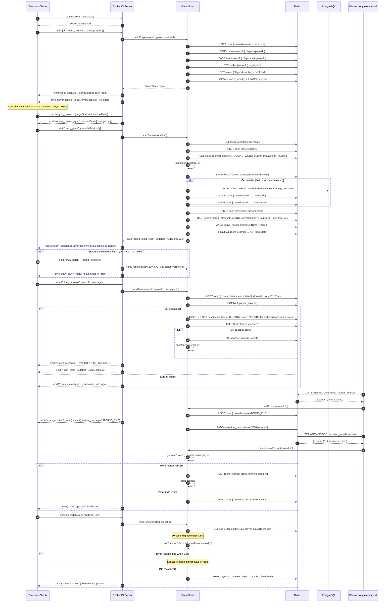

# WORKFLOW.md — End-to-End Request & Game Flow

## Game State Machine

The game follows a finite state machine (FSM) with five states:

```
LOBBY → CHOOSING_WORD → PLAYING → ROUND_END → (next PLAYING or GAME_OVER)
                                               ↑___________________________|
```

> **Note:** `CHOOSING_WORD` is persisted as a transient status during `startGame` initialization. The system immediately advances to `PLAYING` via `startRound` — there is no word-picking UI; the word is selected server-side automatically. The state is kept for future UI extensibility.

---

## Full Session Sequence Diagram



---

## Edge Cases & Failure Handling

### Round Timer Drift
The worker loop fires every 1000ms via `setInterval`. JavaScript's event loop is single-threaded; if a prior tick is blocked by async I/O (e.g., slow Redis response), the next tick fires late. To mitigate this, round end times are stored as **absolute Unix timestamps in Redis** (`roundEndTime`), not relative countdown values. The worker queries `ZRANGEBYSCORE active_rounds -inf <now>` — so even if the worker fires 200ms late, it correctly picks up all rounds that should have ended.

### All Players Disconnect Mid-Game
If a disconnect brings active player count below 2:
1. `processNextRound` detects `activeCount < 2`.
2. Room is reset to `LOBBY` state.
3. The leaderboard is preserved; timers are cleared.
4. The `room_activity` sorted set still tracks the room — the stale room GC (30-minute TTL assessed by worker) will clean it up if nobody rejoins.

### Player Joins During Active Round
When a new socket fires `join_room` while the room is `PLAYING`:
1. The `player_joined` event is emitted to **all other sockets** in the room.
2. The drawer's `DrawingCanvas` listens for `player_joined` and immediately calls `canvas.toDataURL()` to snapshot the current drawing, then emits `sync_canvas` directly to the new player's socket ID.
3. The new player receives `receive_canvas_sync` and draws the image onto their blank canvas — providing near-instant state catch-up without the server holding any canvas data.

This is a **peer-to-peer canvas sync** routed through the server. The server only bridges the socket IDs; it never decodes or stores the canvas image.

### Redis Connection Loss
`ioredis` has built-in reconnection with exponential backoff. During reconnection, all handler methods that await Redis will throw errors caught by the try/catch in `workerLoop`. Game state in memory is zero — so a brief Redis outage means the worker skips ticks but does not corrupt state. Once Redis reconnects, the sorted sets pick up from where they left off.

### Duplicate Player IDs
`addPlayer` checks `SISMEMBER room:{roomId}:players:set` before inserting. If the player ID already exists (reconnect scenario), only the socket mapping is updated (`SET player:{id}:socket = newSocketId`) — the player data hash is untouched, preserving score.
